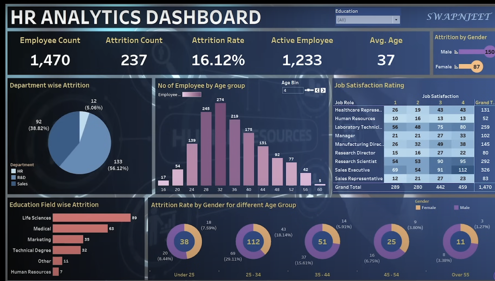

# HR Analytics Dashboard
## Overview
### The HR Analytics Dashboard provides an interactive visualization of key HR metrics, helping organizations understand employee attrition, satisfaction, and demographics. This dashboard is built using Tableau and includes several key metrics and visualizations, such as attrition rates, employee counts, job satisfaction ratings, and demographic distributions.

## Dashboard Elements
### Employee Count: Total number of employees in the organization.
### Attrition Count: Number of employees who have left the organization.
### Attrition Rate: Percentage of employees who have left the organization.
### Active Employees: Number of current employees.
### Average Age: Average age of employees.
### Attrition by Gender: Visualization of attrition rates broken down by gender.
### Department-wise Attrition: Pie chart showing attrition rates across different departments.
### Number of Employees by Age Group: Bar chart displaying the distribution of employees across different age groups.
### Job Satisfaction Rating: Heatmap showing job satisfaction ratings across different job roles.
### Education Field-wise Attrition: Bar chart showing attrition rates across different fields of education.
### Attrition Rate by Gender for Different Age Groups: Donut charts showing attrition rates by gender across different age groups.
## Data Source
### The data used in this dashboard is sourced from the HR department's internal employee records. It includes information on employee demographics, job roles, job satisfaction ratings, and attrition details.

## Data Cleansing
### Data cleansing is a crucial step to ensure the accuracy and reliability of the dashboard. The following steps were taken to cleanse the data:

### Handling Missing Values: Missing values in key fields such as employee count, attrition count, and job satisfaction ratings were identified and handled. Depending on the nature of ### the data, missing values were either imputed using appropriate statistical methods or removed if they were insignificant.
### Data Consistency: Ensured consistency in data formats, such as date formats, numerical values, and categorical labels.
### Outlier Detection: Identified and addressed outliers in the data, particularly in fields like age, job satisfaction ratings, and tenure.
### Duplicate Records: Removed any duplicate records to maintain data integrity.
## Data Modeling
### Data modeling involved structuring the data to support the analysis and visualizations in the dashboard. The following steps were taken:

### Schema Design: Designed a schema that includes tables for employee details, job roles, job satisfaction ratings, and attrition data.
### Relationships: Established relationships between tables based on common keys such as employee ID, department ID, and job role ID.
### Calculated Fields: Created calculated fields to derive metrics such as attrition rate, average age, and satisfaction scores.
## Data Transformation
###  transformation steps were necessary to prepare the data for analysis and visualization. The following transformations were performed:

### Normalization: Normalized data to eliminate redundancy and improve data integrity.
### Aggregation: Aggregated data to derive summary metrics such as total employee count, attrition count, and average age.
### Pivoting: Pivoted data to convert columns into rows where necessary, particularly for job satisfaction ratings.
### Filtering: Applied filters to exclude irrelevant data, such as former employees from active employee counts.
### Deriving Metrics: Used calculated fields to derive metrics like attrition rate (Attrition Rate = (Attrition Count / Employee Count) * 100).
## Visualization Design
### The design of the dashboard follows best practices for data visualization to ensure clarity and ease of interpretation. Key considerations include:

### Color Coding: Used consistent color schemes to represent different categories and metrics.
### Chart Types: Selected appropriate chart types (e.g., pie charts, bar charts, heatmaps) based on the nature of the data and the insights to be conveyed.
### Interactivity: Added interactive elements such as filters and tooltips to allow users to explore the data in more detail.
### Layout: Arranged visualizations logically to guide the user through the key metrics and insights.
Usage
### The dashboard can be accessed and interacted with through Tableau. Users can apply filters, hover over visualizations for more details, and drill down into specific metrics for deeper insights. The dashboard is designed to be intuitive and user-friendly, making it accessible to both technical and non-technical users.

## Conclusion
### This HR Analytics Dashboard provides a comprehensive view of key HR metrics, enabling organizations to monitor employee attrition, satisfaction, and demographics effectively. By following the data cleansing, modeling, and transformation steps outlined above, the dashboard ensures accurate and reliable insights.
